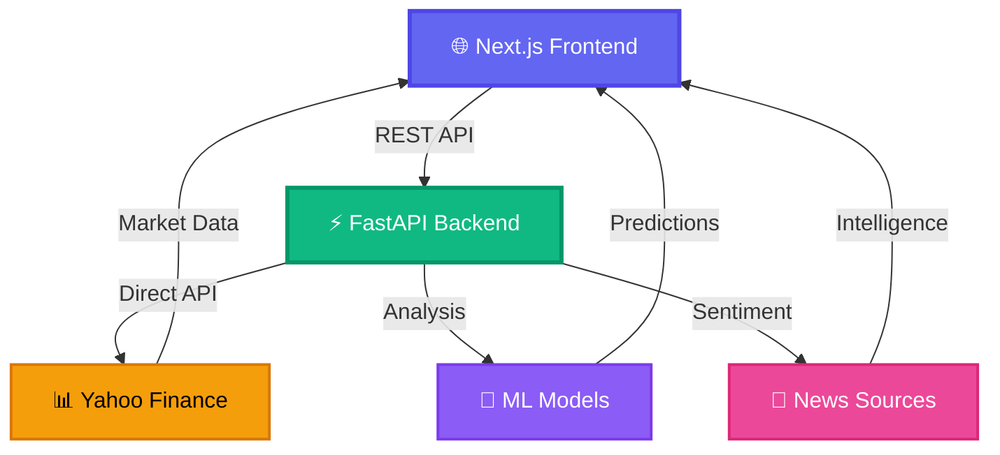

# <div align="center">📈 **StockIQ Pro** 🚀</div>

<div align="center">

### 🏆 **Professional Stock Analysis Platform with AI-Powered Predictions**

*Enterprise-grade market intelligence for smart investors, powered by Machine Learning*

[](https://nextjs.org/)
[](https://fastapi.tiangolo.com/)
[](https://www.python.org/)
[](https://tailwindcss.com/)
[](https://opensource.org/licenses/MIT)

**[🌐 Live Demo](https://your-app.vercel.app)** • **[📖 Documentation](https://github.com/visheshsanghvi112/Analysis-tool/wiki)** • **[🐛 Report Bug](https://github.com/visheshsanghvi112/Analysis-tool/issues)** • **[✨ Request Feature](https://github.com/visheshsanghvi112/Analysis-tool/issues)**

</div>

---

## ⚠️ **Legal Disclaimer & Regulatory Compliance**

> [!WARNING]
> **StockIQ Pro is strictly an educational and data visualization tool.** 
> None of the technical indicators, machine learning forecasts, sentiment analytics, or risk scores presented constitute certified financial advice, investment recommendations, or buy/sell/hold signals. 
> 
> * **No Financial Liability:** The developers, contributors, and authors of StockIQ Pro accept absolutely zero liability for any trading losses, financial capital losses, or indirect damages incurred as a result of using this platform.
> * **Regulatory Alignment:** We do not hold registrations with SEBI, SEC, or any other financial regulatory authority. You are entirely responsible for your own trading decisions. Always consult a certified, licensed financial professional before investing.
> * **Terms of Service:** By running, hosting, or using this codebase, you agree to our complete [Terms & Conditions](frontend/src/app/terms/page.js) limiting legal liability.

---

## 🎯 **Why StockIQ Pro?**

<table>
<tr>
<td width="50%">

### 💎 **For Investors**
- 🎓 **Learn like a Pro**: Institutional-grade analytics worth $24,000/year (Bloomberg Terminal equivalent) - **completely FREE**
- 🤖 **AI-Powered Insights**: Random Forest ML models analyze 20+ indicators to predict price movements
- 📊 **Risk Management**: Professional VaR, Sharpe ratios, and portfolio metrics at your fingertips
- 📰 **Smart News**: Multi-source aggregation with AI sentiment analysis

</td>
<td width="50%">

### 🛠️ **For Developers**
- ⚡ **Modern Stack**: Next.js 16 + FastAPI + Tailwind CSS
- 🎨 **Beautiful UI**: Cyberpunk-inspired design with glassmorphism & gradients
- 🔐 **Enterprise Security**: Rate limiting, CORS, CSP headers, input validation
- 🚀 **Production-Ready**: Deployed on Vercel with serverless architecture

</td>
</tr>
</table>

---

## ✨ **Key Features**

### 🌟 **Core Capabilities**

<table>
<tr>
<td align="center" width="25%">

<h4>💰 Live Market Data</h4>
<p><small>Real-time NSE/BSE prices with interactive charts & technical indicators</small></p>
</td>

<td align="center" width="25%">

<h4>🧠 AI Predictions</h4>
<p><small>5-day forecasts using Random Forest with 70%+ confidence</small></p>
</td>

<td align="center" width="25%">

<h4>📊 Risk Analytics</h4>
<p><small>VaR, Sharpe ratio, beta analysis & portfolio optimization</small></p>
</td>

<td align="center" width="25%">

<h4>📰 News Intelligence</h4>
<p><small>Multi-source news with AI sentiment & impact scoring</small></p>
</td>
</tr>
</table>

### 🔥 **Advanced Analytics**

| Feature | Description | Professional Equivalent |
|---------|-------------|------------------------|
| **📈 Technical Analysis** | RSI, MACD, Bollinger Bands, ADX, Stochastic | TradingView Premium ($60/mo) |
| **🎯 ML Predictions** | Random Forest with 20+ indicators & confidence intervals | QuantConnect Alpha ($20/mo) |
| **💼 Portfolio Metrics** | VaR, Sharpe, Sortino, Max Drawdown, Beta vs Nifty | Bloomberg Terminal ($24k/year) |
| **⚡ Options Pricing** | Black-Scholes model with Greeks (Delta, Gamma, Vega, Theta) | Options Analytics Tools ($50/mo) |
| **📰 News Sentiment** | Multi-source aggregation with AI impact scoring | RavenPack ($1000/mo) |
| **🔍 Smart Search** | Type-ahead search across 1000+ NSE/BSE stocks | Professional screeners ($30/mo) |

---

## 🚀 **Quick Start Guide**

### 📋 **Prerequisites**

```bash
Node.js 18+  •  Python 3.9+  •  Git
```

### 1️⃣ **Clone the Repository**

```bash
git clone https://github.com/visheshsanghvi112/Analysis-tool.git
cd Analysis-tool
```

### 2️⃣ **Backend Setup** (FastAPI)

```bash
cd backend

# Install dependencies
pip install -r requirements.txt

# Set up environment (optional)
cp .env.example .env

# Start the server 🚀
python main.py
```

✅ **Backend running at:** `http://localhost:8000`  
📖 **API Docs:** `http://localhost:8000/docs`

### 3️⃣ **Frontend Setup** (Next.js)

```bash
cd frontend

# Install dependencies
npm install

# Set up environment
echo "NEXT_PUBLIC_API_URL=http://localhost:8000" > .env.local

# Start development server 🎨
npm run dev
```

✅ **Frontend running at:** `http://localhost:3000`

---

## 🏗️ **Architecture**

<div align="center">



</div>

### 📁 **Project Structure**

```
📦 Analysis-tool
├── 📂 frontend/                    # Next.js 16 Application
│   ├── 📂 src/app/
│   │   ├── 📂 components/         # React Components
│   │   │   ├── 🔍 Header.js       # Search & Navigation
│   │   │   ├── 💰 LivePrice.js    # Real-time Quotes
│   │   │   ├── 📈 StockChart.js   # Interactive Charts
│   │   │   ├── 🧠 MLPrediction.js # AI Forecasts
│   │   │   ├── 📰 AdvancedNews.js # News Sentiment
│   │   │   └── 📊 PortfolioMetrics.js # Risk Analytics
│   │   ├── 🎨 globals.css         # Cyberpunk Styling
│   │   ├── 📄 page.js             # Main Dashboard
│   │   └── 🏗️ layout.js           # App Layout
│   ├── ⚙️ next.config.mjs         # Next.js Config
│   ├── 🎨 tailwind.config.js      # Tailwind Config
│   └── 📦 package.json            # Dependencies
│
├── 📂 backend/                     # FastAPI Application
│   ├── 📂 api/
│   │   └── 🚀 index.py            # Vercel Serverless Entry
│   ├── 🔧 engine.py               # Technical Analysis Engine
│   ├── 🧠 ml_models.py            # Random Forest Models
│   ├── 📰 news_intelligence.py    # News Aggregation
│   ├── 📊 yf_client.py            # Yahoo Finance Client
│   ├── 🌐 main.py                 # FastAPI App & Routes
│   ├── 📋 requirements.txt        # Python Dependencies
│   └── ⚙️ vercel.json             # Deployment Config
│
└── 📖 README.md                    # You are here! 👈
```

---

## 🔐 **Security & Performance**

### 🛡️ **Security Features**

| Layer | Implementation | Protection |
|-------|---------------|------------|
| **🔒 Rate Limiting** | 30 requests/min per IP | DDoS & Abuse Prevention |
| **🎯 Input Validation** | Regex patterns & sanitization | SQL Injection & XSS |
| **🌐 CORS** | Whitelisted origins only | Cross-origin attacks |
| **🔐 CSP Headers** | Strict Content Security Policy | XSS & clickjacking |
| **⏱️ Timeouts** | 10s API timeout limit | Hanging requests |
| **🚫 Error Handling** | No sensitive data in errors | Information leakage |

### ⚡ **Performance Optimizations**

- **Frontend**: Code splitting, lazy loading, image optimization, caching
- **Backend**: Async processing, connection pooling, data compression
- **Database**: Redis caching for frequently accessed data (planned)
- **CDN**: Static assets served via Vercel Edge Network

---

## 🌐 **API Reference**

### 📡 **Core Endpoints**

```javascript
// 1. 💰 Live Price Data
GET /api/live?ticker=HDFCBANK.NS
Response: { ticker, price, change, changePct, dayHigh, dayLow, volume }

// 2. 📈 Technical Analysis
GET /api/analyze?ticker=HDFCBANK.NS
Response: { ticker, summary, indicators, chartData, fundamentals }

// 3. 🧠 ML Predictions
GET /api/ml-predict?ticker=HDFCBANK.NS
Response: { prediction, confidence, signal, target_price }

// 4. 📰 News Sentiment
GET /api/advanced-news?ticker=HDFCBANK.NS
Response: { news[], sentiment, impact_score, breaking_news[] }

// 5. 📊 Portfolio Metrics
GET /api/portfolio-metrics?ticker=HDFCBANK.NS
Response: { var_95, sharpe_ratio, beta, options_pricing }

// 6. 🔍 Stock Search
GET /api/tickers?q=hdfc
Response: { tickers: [{ symbol, name, sector }] }
```

### 📊 **Example Response**

```json
{
  "ticker": "IRFC.NS",
  "prediction": {
    "predicted_return": -0.88,
    "predicted_price": 92.51,
    "current_price": 93.33,
    "signal": "SELL",
    "signal_strength": 8.8,
    "confidence": 70.7,
    "prediction_horizon_days": 5,
    "timestamp": "2026-06-11T13:06:02"
  },
  "disclaimer": "For educational purposes only. Not financial advice."
}
```

---

## 🚀 **Deployment**

### **Vercel (Recommended)** ⚡

#### Backend Deployment
```bash
cd backend
vercel --prod
```

#### Frontend Deployment
```bash
cd frontend
vercel --prod
```

### **Environment Variables**

#### 🔧 Backend `.env`
```bash
ENVIRONMENT=production
ALLOWED_ORIGINS=https://your-frontend.vercel.app
RATE_LIMIT_PER_MINUTE=30
```

#### 🎨 Frontend `.env.production`
```bash
NEXT_PUBLIC_API_URL=https://your-backend.vercel.app
NEXT_PUBLIC_APP_ENV=production
```

---

## 📊 **Tech Stack**

<div align="center">

| Category | Technologies |
|----------|-------------|
| **Frontend** | Next.js 16, React 19, Tailwind CSS 3, Recharts, Lucide Icons |
| **Backend** | FastAPI, Python 3.9+, NumPy, Pandas, Scikit-learn |
| **ML/AI** | Random Forest, Technical Indicators, Sentiment Analysis |
| **Data** | Yahoo Finance API, News aggregation (RSS/APIs) |
| **Deployment** | Vercel (Serverless), Edge Network CDN |
| **Security** | CORS, CSP, Rate Limiting, Input Validation |

</div>

---

## 🤝 **Contributing**

We love contributions! 🎉

### **How to Contribute**

1. 🍴 **Fork** the repository
2. 🌿 **Create** a feature branch  
   ```bash
   git checkout -b feature/AmazingFeature
   ```
3. ✍️ **Commit** your changes  
   ```bash
   git commit -m 'Add: Amazing new feature'
   ```
4. 📤 **Push** to the branch  
   ```bash
   git push origin feature/AmazingFeature
   ```
5. 🔀 **Open** a Pull Request

### **Code Standards**
- ✅ Follow ESLint rules for JavaScript/React
- ✅ Use Black formatter for Python code
- ✅ Write meaningful commit messages
- ✅ Add tests for new features

---

## 📄 **License**

This project is licensed under the **MIT License** - see the [LICENSE](LICENSE) file for details.

---

## 👨‍💻 **Author**

<div align="center">

### **Vishesh Sanghvi**

[](https://github.com/visheshsanghvi112)
[](mailto:visheshsanghvi112@gmail.com)
[](https://linkedin.com/in/vishesh-sanghvi)

*Passionate about building financial technology that democratizes access to professional-grade analytics* 💎

</div>

---

## 🙏 **Acknowledgments**

Special thanks to:

- 📊 **Yahoo Finance** for providing market data APIs
- ⚡ **Vercel** for seamless deployment and hosting
- 🎨 **Tailwind CSS** for the utility-first framework
- 📈 **Recharts** for beautiful data visualizations
- 🎯 **Lucide React** for the icon library
- 🚀 **Next.js & FastAPI** teams for amazing frameworks

---

## 🆘 **Support**

Need help? We're here for you!

- 📖 **Documentation**: [GitHub Wiki](https://github.com/visheshsanghvi112/Analysis-tool/wiki)
- 🐛 **Bug Reports**: [Create an Issue](https://github.com/visheshsanghvi112/Analysis-tool/issues/new?template=bug_report.md)
- 💡 **Feature Requests**: [Request a Feature](https://github.com/visheshsanghvi112/Analysis-tool/issues/new?template=feature_request.md)
- 💬 **Discussions**: [Join the Discussion](https://github.com/visheshsanghvi112/Analysis-tool/discussions)
- 📧 **Email**: [visheshsanghvi112@gmail.com](mailto:visheshsanghvi112@gmail.com)

---

<div align="center">

### ⭐ **Star this repo if you found it helpful!** ⭐

*Built with 💜 by [Vishesh Sanghvi](https://github.com/visheshsanghvi112)*

**[🔝 Back to Top](#stockiq-pro)**

---

 


**Made in 🇮🇳 India with ❤️ for Global Investors**

</div>