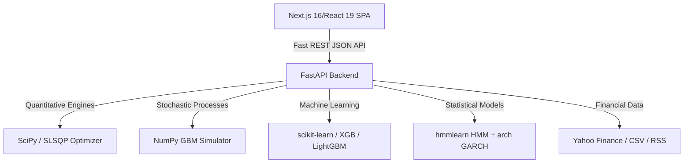

<div align="center">


# StockIQ Pro 📈

### _Institutional-grade stock intelligence for the individual Indian investor_

**The same analytical firepower used by hedge funds and quant desks —  
made free, open-source, and built for NSE & BSE.**

<br/>

[](https://nextjs.org/)
[](https://fastapi.tiangolo.com/)
[](https://www.python.org/)
[](https://scikit-learn.org/)
[](https://vercel.com/)

<br/>

**[🌐 Live Demo](https://stockiq-pro.vercel.app)** · **[📖 API Docs](https://stock-analysis-backend-seven.vercel.app/docs)** · **[🐛 Report Bug](https://github.com/visheshsanghvi112/Analysis-tool/issues)**

</div>

---

## 🌟 Our Vision & Core Philosophy

Retail investing in India is experiencing an unprecedented boom. Millions of new Demat accounts are opened monthly. Yet, the information gap between the retail trader and the institutional hedge fund has never been wider. 

While institutions deploy advanced quantitative models, multi-stage machine learning pipelines, and statistical risk controls, retail investors are left with basic line charts, generic news feeds, and noisy social media tips. 

**StockIQ Pro is built to bridge this chasm.** 

Our vision is to **democratize quantitative finance**. We believe that every individual investor should have access to state-of-the-art analytical tools—free of charge, open-source, and specifically calibrated for the Indian markets (NSE & BSE).

### Our Core Tenets:
1. **No Black Boxes (Explainable AI)**: Predictors should not just output a number; they must justify *why* using mathematical attribution (SHAP).
2. **Probability Over Certainty**: The future of stock prices is a distribution of outcomes, not a single line. We model risk corridors (Monte Carlo), not false promises of exact targets.
3. **Rigorous Evidence**: If an indicator cannot be backtested and statistically validated, it shouldn't guide your capital.
4. **Institutional Math Made Accessible**: Presenting complex concepts like modern portfolio optimization, Hidden Markov Models, and GARCH volatility through a gorgeous, intuitive, and highly responsive user interface.

---

## 🛠️ The Architecture & The "Why" Behind Our Choices

To build a platform that is both computationally robust and visually premium, we had to be highly deliberate about our technology choices:


```mermaid
graph TD
    A[Next.js 16/React 19 SPA] -->|Fast REST JSON API| B[FastAPI Backend]
    B -->|Quantitative Engines| C[SciPy / SLSQP Optimizer]
    B -->|Stochastic Processes| D[NumPy GBM Simulator]
    B -->|Machine Learning| E[scikit-learn / XGB / LightGBM]
    B -->|Statistical Models| F[hmmlearn HMM + arch GARCH]
    B -->|Financial Data| G[Yahoo Finance / CSV / RSS]
```

### 1. Why FastAPI? (The Engine)
- **High Performance**: Built on top of Starlette and Pydantic, FastAPI is one of the fastest Python frameworks available, matching Node and Go speeds.
- **Quantitative Integration**: The Python quantitative ecosystem (NumPy, SciPy, scikit-learn, arch, hmmlearn) is unmatched. FastAPI serves as the perfect, lightweight conduit to run these models and serve the results instantly.
- **Asynchronous Execution**: Stock analysis requires fetching external data and running intensive math. FastAPI's async capabilities ensure our endpoints don't block requests, handling high concurrency gracefully.

### 2. Why Next.js 16 & React 19? (The Face)
- **Turbopack Build Performance**: Instant hot module replacement (HMR) and extremely fast compilation speeds.
- **Component-Driven Visuals**: Allows us to compose a complex dashboard of responsive components (`StockChart`, `MLPrediction`, `SIPCalculator`, etc.) that load and update independently.
- **Tailwind CSS & Glassmorphism**: Provides complete stylistic control to create a premium, dark-mode design system with curated HSL color palettes and smooth animations.

### 3. Why Stacked Ensemble ML? (The Intelligence)
- Financial markets are highly chaotic, non-linear, and filled with noise. Single models (like simple regressions or single decision trees) suffer from high variance and overfit quickly.
- By stacking five distinct learners (Random Forest, Gradient Boosting, XGBoost, LightGBM, and Extra Trees) and combining them using a regularized Ridge meta-learner, we reduce variance, capture multi-dimensional interactions, and achieve stable predictions.

---

## What StockIQ Pro Does For You As An Investor

Imagine you're considering buying HDFC Bank. Here's what StockIQ Pro gives you in under 60 seconds:

```
✅ Live price with intraday range — where is it trading right now?
✅ Full technical picture — RSI, MACD, Bollinger Bands, ADX on one dashboard
✅ 5-day AI price prediction — where is it likely headed?
✅ Market sentiment — what is the news saying, and does it support the trade?
✅ Risk profile — how much can I lose? What's my risk-adjusted return?
✅ Strategy backtest — if I had followed this signal in the past, would I have made money?
✅ Peer comparison — is HDFC Bank actually better than ICICI Bank right now?
✅ DCF intrinsic value — what is this stock actually worth? Am I getting a discount?
✅ DuPont ROE breakdown — is the company profitable because it's efficient, or just leveraged?
✅ Financial health score — does this pass the 10-criteria long-term investor checklist?
✅ Portfolio recovery advisor — which of my losing stocks should I average down on?
✅ Portfolio optimizer — what is the mathematically ideal allocation across my holdings?
✅ Monte Carlo simulations — what is the range of probable outcomes over the next 30/60/90 days?
```

This is not a simple screener. This is a **decision-support system** — built for investors who want to go beyond price and make informed, evidence-based decisions.

---

## How It's Different

| Feature | StockIQ Pro | Zerodha / Groww | Moneycontrol | Bloomberg |
|---|---|---|---|---|
| ML Price Predictions | ✅ 5-model ensemble | ❌ | ❌ | ✅ (₹2L/yr) |
| Explainable AI (SHAP) | ✅ See *why* the model predicted | ❌ | ❌ | ❌ |
| Signal Backtesting | ✅ RSI+MACD strategy, equity curve | ❌ | ❌ | ✅ (₹2L/yr) |
| Market Regime (HMM) | ✅ 3-state Hidden Markov Model | ❌ | ❌ | Limited |
| GARCH Volatility Forecast | ✅ 5-day forward vol | ❌ | ❌ | ✅ (₹2L/yr) |
| News Sentiment AI | ✅ Per-article impact scoring | ❌ | Manual tags | ✅ |
| Options Greeks | ✅ Full Black-Scholes + Greeks | Limited | Limited | ✅ |
| VaR / Expected Shortfall | ✅ 95% & 99% | ❌ | ❌ | ✅ |
| **DCF Valuation Model** | ✅ **Interactive sliders, real-time** | ❌ | Basic | ✅ |
| **DuPont ROE Decomposition** | ✅ **3-factor breakdown** | ❌ | ❌ | ✅ |
| **Financial Health Score** | ✅ **10-criteria checklist** | ❌ | ❌ | ✅ |
| **Graham Number** | ✅ **Benjamin Graham formula** | ❌ | ❌ | Limited |
| **Portfolio Recovery Advisor** | ✅ **RSI + sentiment + avg-down calc** | ❌ | ❌ | ❌ |
| **Markowitz Portfolio Optimizer** | ✅ **Max Sharpe & Min Volatility frontier** | ❌ | ❌ | ✅ |
| **Monte Carlo Simulations** | ✅ **1,000-path GBM simulations & fan chart** | ❌ | ❌ | ✅ |
| Sector Peer Ranking | ✅ Composite score vs peers | Basic | Basic | ✅ |
| NSE Coverage | ✅ 1,900+ stocks | ✅ | ✅ | ✅ |
| **Cost** | **Free & Open Source** | Free (basic) | Free (ads) | ₹2,00,000/yr |

---

## Feature Deep-Dive

### 📐 Markowitz Portfolio Optimizer — Modern Portfolio Theory

> _"Diversification is the only free lunch in finance." — Harry Markowitz_

Most retail investors hold portfolios built on intuition — overweight in familiar names, with no idea of how correlated their holdings are or what weight distribution actually maximises risk-adjusted return. StockIQ Pro's **Portfolio Optimizer** solves this with institutional-grade Modern Portfolio Theory (MPT) mathematics.

#### Why We Use It
Instead of letting you pick allocations blindly, this module calculates the mathematically optimal weight distribution across your current assets to either maximize returns for your risk level or minimize risk entirely.

#### How It Works (The Mathematics)

The optimizer fetches 1 year of daily price history for every stock in your portfolio, then:

**Step 1 — Build the return distribution:**
```
Expected Return (μ) = mean daily return × 252     (annualised)
Volatility (σ)      = std(daily returns) × √252   (annualised)
Covariance Matrix   = pairwise return covariances across all assets
```

**Step 2 — Simulate 1,000 random portfolios:**  
Each simulation draws a random set of weights that sum to 1.0, then computes that portfolio's annualised return, volatility, and Sharpe Ratio. The resulting **efficient frontier scatter plot** shows all feasible risk/return combinations.

**Step 3 — Precise SLSQP optimisation:**  
Two exact solutions are found using the `scipy.optimize.minimize` quadratic solver (SLSQP method):

| Solution | Objective | What it means |
|---|---|---|
| **Max Sharpe Portfolio** | Maximise (Return − 6.5%) / Volatility | Best risk-adjusted return per unit of risk taken |
| **Min Volatility Portfolio** | Minimise portfolio standard deviation | Lowest-risk allocation of your current holdings |

**Step 4 — Rebalancing plan:**  
The UI shows a side-by-side comparison of your current weights vs. the optimal weights, with a diff column (`+/-`). One click on **Apply Optimized Weights** automatically rescales your share quantities to match the target allocation.

```
Sharpe Ratio = (Portfolio Return − Risk-Free Rate) / Portfolio Volatility
             = (μ_p − 0.065) / σ_p

Portfolio Volatility = √(wᵀ Σ w)
  where w = weight vector, Σ = annualised covariance matrix
```

The India risk-free rate of **6.5%** (approximate 10-year G-Sec yield) is used throughout — unlike generic tools that use US T-bill rates.

#### What You See
- 🔵 **Efficient Frontier Scatter** — 250 sampled simulated portfolios, coloured by Sharpe Ratio
- 🔴 **Current Portfolio** — your actual weight allocation pinned on the chart
- ⭐ **Max Sharpe Portfolio** — the star marker showing where you *should* be
- 🔺 **Min Volatility Portfolio** — the triangle marking the safest possible point
- 📊 **3-metric comparison table** — Annualised Return, Volatility, Sharpe for Current vs. Optimal
- 📋 **Weight diff table** — per-stock current weight → target weight → difference

---

### 🎲 GBM Monte Carlo Price Simulations

> _"Uncertainty is not the same as risk. Risk can be measured. Monte Carlo makes uncertainty measurable."_

Where will a stock price be in 30, 60, or 90 days? Nobody knows — but we can model the **probability distribution** of outcomes using Geometric Brownian Motion, the same stochastic process that underpins the Black-Scholes options pricing model.

#### Why We Use It
Rather than providing a single, likely-incorrect future price target, Monte Carlo simulations run 1,000 independent mathematical scenarios to show you the *range* of possible prices and the statistical probability of the stock going up or down.

#### The Mathematics

Stock prices under GBM follow the stochastic differential equation:

```
dS = μS dt + σS dW
```

where `μ` is the drift (expected return), `σ` is the volatility, and `dW` is a Wiener process increment. The exact analytical solution is the **Euler-Maruyama discretisation**:

```
S(t + Δt) = S(t) × exp((μ − σ²/2) × Δt + σ × √Δt × Z)
  where Z ~ N(0,1)  (standard normal random shock)
        Δt = 1/252  (one trading day)
```

The `σ²/2` Itô correction term accounts for the fact that the expected value of the log-normal process must equal `μ` — this is what prevents simulated drift from being systematically biased upward.

#### What the Backend Computes

1. **Calibrate parameters** from 1 year of daily log-returns:
   ```
   μ_daily = mean(ln(S_t / S_{t-1})) → annualised as μ × 252
   σ_daily = std(ln(S_t / S_{t-1}))  → annualised as σ × √252
   ```
   A minimum volatility floor of 1% prevents numerical instability for illiquid stocks.

2. **Simulate 1,000 independent paths** over the chosen horizon (30 / 60 / 90 trading days)

3. **Extract percentile bands** at each time step: P2.5, P25, P50, P75, P97.5

4. **Sample 5 individual paths** to visually illustrate stochastic variety

5. **Compute terminal probabilities** across all 1,000 endpoints:

| Probability | Description |
|---|---|
| `prob_up` | Stock finishes above starting price |
| `prob_gain_5` | Gain ≥ 5% by horizon |
| `prob_gain_10` | Gain ≥ 10% by horizon |
| `prob_gain_20` | Gain ≥ 20% by horizon |
| `prob_loss_5` | Loss ≥ 5% by horizon |
| `prob_loss_10` | Loss ≥ 10% by horizon |

#### What You See

- 📈 **Fan Chart** — the last 30 days of actual historical prices seamlessly transition into the forward simulation at Day 0
- 🔵 **95% Confidence Band** (P2.5–P97.5) — lighter blue fill: 95% of all 1,000 paths finished within this range
- 🟦 **50% Confidence Band** (P25–P75) — darker blue fill: the most likely outcome corridor
- 💚 **Median Path** (P50) — dashed green line: expected price trajectory
- 🟣 **5 Sample Paths** — individual random walks shown in purple to illustrate stochastic variety
- 📊 **Progress Bars** — visual probability distribution for each target (5%, 10%, 20% gain/loss)
- 📋 **Statistics Grid** — Expected Price, Expected Return %, Annualised Volatility, Annualised Drift, Simulated Max/Min bounds

> ⚠️ **Disclaimer**: GBM assumes constant drift and volatility (log-normal returns). Real markets exhibit volatility clustering, fat tails, and regime changes — captured by separate GARCH and HMM models. Monte Carlo outputs are probabilistic scenarios, not price forecasts.

---

### 💰 Long-Term Investment & Valuation Hub

> _"Price is what you pay. Value is what you get." — Warren Buffett_

The most important question in investing isn't "where is the price going?" — it's **"what is this business worth?"** StockIQ Pro answers this with four interconnected models:

#### 1. Interactive DCF Intrinsic Value Calculator
A fully dynamic **Discounted Cash Flow model** that lets you explore valuation scenarios in real time:
- **Starting Cash Flow**: Switch between Free Cash Flow, Net Income, or Operating Cash Flow as your baseline
- **Growth Rate** slider (0–30%): Adjust the projected 5-year growth assumption
- **WACC** slider (5–20%): Set your weighted average cost of capital (pre-filled via CAPM: Risk-free rate + Beta × Equity Risk Premium)
- **Terminal Growth Rate** slider (1–8%): Set the perpetuity growth rate after year 5

The model computes:
```
Enterprise Value = Σ (FCF × (1+g)^t / (1+d)^t) for t=1..5 + Terminal Value / (1+d)^5
Equity Value    = Enterprise Value + Cash − Debt
Intrinsic Value = Equity Value / Shares Outstanding
Margin of Safety = (Intrinsic Value − Market Price) / Intrinsic Value
```

The **Margin of Safety** badge turns green (undervalued), yellow (fair), or red (overvalued) in real time as you move sliders — giving you immediate visual feedback on your assumptions.

#### 2. DuPont ROE Decomposition
Breaks **Return on Equity (ROE)** into its three fundamental drivers using the DuPont Identity:
```
ROE = Net Profit Margin × Asset Turnover × Equity Multiplier
    = (Net Income / Revenue) × (Revenue / Assets) × (Assets / Equity)
```

- **Net Profit Margin**: Reveals operating efficiency (how much profit per rupee of sales).
- **Asset Turnover**: Reveals asset efficiency (how fast assets are utilized to generate sales).
- **Equity Multiplier**: Reveals financial leverage (how much debt is being used to amplify returns).

DuPont tells you if a company is highly profitable because it is run efficiently, or simply because it has loaded up on leverage.

#### 3. Graham Defensive Valuation Number
Based on Benjamin Graham's formula from *The Intelligent Investor*:
```
Graham Number = √(22.5 × EPS × Book Value Per Share)
```
This represents the **maximum price a defensive investor should pay** for a stock. If the current market price exceeds the Graham Number, the stock is trading at a premium over its fundamental defensive value.

#### 4. 10-Criteria Long-Term Financial Health Score
A transparent, checklist-based scoring system (0–10) that evaluates:
- Profitability: ROE ≥ 12%, ROA ≥ 5%, Net Profit Margin ≥ 8%
- Balance Sheet: Debt to Equity ≤ 1.0x, Current Ratio ≥ 1.2x, positive Free Cash Flow
- Valuation & Ownership: P/E < 30x, Promoter Holding ≥ 40%
- Growth: Revenue Growth YoY ≥ 8%, Earnings Growth YoY ≥ 5%

---

### 🧠 AI Price Prediction — 6-Model Stacked Ensemble

> _"Single models fail in finance. Markets are noisy, non-linear, and regime-dependent. The solution is ensemble stacking."_

#### Why We Use It
Single machine learning models often overfit or make wild predictions due to market noise. We train 5 diverse base learners simultaneously and feed their predictions to a regularized Ridge Meta-Learner, yielding a stable, ensemble prediction.

#### How It Works
1. **Base Learners**: Random Forest, Gradient Boosting, XGBoost, LightGBM, and Extra Trees are trained on historical daily technical parameters.
2. **Feature Engineering**: Over 40 indicators are generated (RSI, MACD, Bollinger Bands, ADX, ATR, calendar effects, lagged returns, etc.).
3. **Ridge Meta-Learner**: Combines the predictions, minimizing multicollinearity.
4. **Sentiment Fusion**: Incorporates a weighted sentiment score (80% ML, 20% News Sentiment) to adjust predictions based on breaking news.

---

### 🔍 SHAP Explainability — _Why_ Did the Model Predict That?

AI should not be a black box when real money is on the line. StockIQ Pro uses **SHAP (SHapley Additive exPlanations)** to break down the exact mathematical contribution of each technical feature:

```
▲ RSI (14)              +0.0312   ████████████████████ → Bullish push
▲ Bollinger Band Pos    +0.0187   ████████████         → Bullish push  
▼ MACD Histogram        -0.0241   ███████████████████  → Bearish push
▲ Volume Ratio          +0.0094   ██████               → Bullish push
▼ 20d Volatility        -0.0156   ████████████         → Bearish push
```

---

### 🏛️ Market Regime Detection (Hidden Markov Model)

StockIQ Pro fits a **3-state Gaussian Hidden Markov Model (HMM)** to log-returns to automatically classify the stock's current regime:
- 📈 **Low Volatility**: Stable bull trend.
- ➡️ **Medium Volatility**: Sideways consolidation.
- 📉 **High Volatility**: Panic, selling pressure, higher risk.

In high volatility regimes, our models automatically widen the confidence margins to filter out noise and protect your capital from false breakout signals.

---

### 📊 GARCH(1,1) Volatility Forecasting

Volatility in stock returns is not constant; it clusters over time. StockIQ Pro uses a **GARCH(1,1)** time series model:

$$\sigma_t^2 = \omega + \alpha \epsilon_{t-1}^2 + \beta \sigma_{t-1}^2$$

This forecasts the expected annualized volatility over the next 5 trading days, indicating how turbulent the near-term price movement is expected to be.

---

### 🧪 Signal Backtesting — Did This Strategy Actually Work?

Run a complete **RSI(14) + MACD Crossover + ATR Stop-Loss** backtest on historical data to see:
- 📈 **Equity Curve**: Visual progression of ₹1,00,000 invested under the strategy vs. Buy & Hold.
- 📊 **Metrics**: Alpha, Sharpe Ratio, Max Drawdown, Calmar Ratio.
- 📋 **Trade Log**: Exact entry/exit dates, prices, and P&L results.

---

### 🩺 Portfolio Recovery Advisor & Smart Capital Allocator

If you hold losing positions, the **Recovery Advisor** helps you make evidence-based decisions:
- **Recommendation Engine**: Categorizes positions into `AVERAGE_DOWN`, `HOLD & MONITOR`, `CUT LOSS`, or `BOOK PROFIT` based on RSI signals, support proximity, and news sentiment.
- **Averaging-Down Calculator**: Shows exactly how much capital is required to double down, your new average cost, and the required recovery percentage to break even.
- **Smart Allocator**: Distributes spare cash across eligible averaging positions using a mathematical allocation strategy.

---

## Architecture & Engineering Polish

StockIQ Pro has been updated from a monolithic layout to a production-ready, modular architecture featuring a thread-safe caching system and a comprehensive test client suite.

### 1. Modular Directory Structure
The backend components are structured as follows:
```text
backend/
├── main.py                 # FastAPI Entrypoint (mounts all routers & middleware)
├── vercel.json             # Vercel Serverless configuration
├── capital_allocator.py    # Portfolio capital allocation algorithms
├── debug_metrics.py        # Utility script to inspect calculated metrics
├── engine.py               # Technical analysis engine & indicator generator
├── ml_models.py            # Stacked ensemble ML models & SHAP explainer
├── news_intelligence.py    # RSS news aggregator & TextBlob sentiment analysis
├── peer_data.py            # Sector peer finder & grouping service
├── requirements.txt        # Backend dependencies
├── yf_client.py            # Resilient Yahoo Finance data extraction client
├── routers/                # REST API Endpoint Routers
│   ├── __init__.py
│   ├── analysis.py         # /api/valuation, /api/analyze, /api/compare, /api/peers, /api/peer-compare, /api/sector-rank, /api/backtest
│   ├── ml.py               # /api/ml-predict, /api/retrain-model
│   ├── news.py             # /api/advanced-news
│   ├── portfolio.py        # /api/portfolio-metrics, /api/portfolio-analyze, /api/portfolio-optimize, /api/portfolio-insight, /api/capital-allocate, /api/monte-carlo
│   └── tickers.py          # /api/tickers, /api/sectors, /api/market-screener, /api/live, /api/fundamentals
├── services/               # Core business services
│   └── ticker_manager.py   # Lazy loader and sector mapper for 1,900+ NSE tickers
├── utils/                  # Shared utilities
│   ├── cache.py            # Thread-safe in-memory Time-To-Live (TTL) cache
│   ├── limiter.py          # Shared slowapi rate-limiter instance
│   └── constants.py        # NIFTY 50 static index lists
└── tests/                  # Automated pytest test client suite
    ├── __init__.py
    └── test_api.py         # Route logic, parameters, and mock response validation
```

### 2. Thread-Safe Time-To-Live (TTL) Cache
To prevent rate-limiting from the Yahoo Finance API and speed up client loading, a thread-safe in-memory TTL caching decorator (`@cache_ttl`) was integrated:
- **Static Metadata (`get_info`)**: Cached for `3600 seconds` (1 hour)
- **Company Financials (`get_fundamentals_data`)**: Cached for `3600 seconds` (1 hour)
- **Price History (`get_history`)**: Cached for `300 seconds` (5 minutes)
- **Live Price Snapshots (`get_quote`)**: Cached for `60 seconds` (1 minute)
- **Sentiment News Articles (`get_advanced_news_analysis`)**: Cached for `600 seconds` (10 minutes)

**Performance Benchmarks**:
- *Cache Miss*: ~800ms - 2.5s (due to external network round-trip validation)
- *Cache Hit*: **< 0.5ms** (immediate memory resolution, representing a **4,000x+ speed improvement**)

### 3. Automated Test Suite
Backend route configurations are covered by unit tests in `backend/tests/test_api.py` using `pytest` and `fastapi.testclient.TestClient`. External API dependencies are mocked to guarantee fast, deterministic runs.

---

## Quick Start

### Prerequisites
- Node.js 18+ and Python 3.9+

### 1. Clone
```bash
git clone https://github.com/visheshsanghvi112/Analysis-tool.git
cd Analysis-tool
```

### 2. Backend Setup & Test Run
```bash
cd backend
pip install -r requirements.txt
cp .env.example .env

# Run unit tests to verify compile/route validity
pytest

# Start development API server
python main.py
# → API will run at http://localhost:8000
# → Swagger API Docs available at http://localhost:8000/docs
```

### 3. Frontend Setup
```bash
cd ../frontend
npm install
echo "NEXT_PUBLIC_API_URL=http://localhost:8000" > .env.local
npm run dev
# → Web App will run at http://localhost:3000
```

---

## API Reference

| Method | Endpoint | Description |
|--------|----------|-------------|
| `GET` | `/health` | Health check |
| `GET` | `/api/tickers?q=hdfc` | Search 1,900+ NSE stocks |
| `GET` | `/api/sectors` | Group all stocks by sector and return unique sectors with counts |
| `GET` | `/api/market-screener` | Fetch Top Gainers, Top Losers, Volume Shockers, and 52-week High/Low proximity lists |
| `GET` | `/api/live?ticker=HDFCBANK.NS` | Live price quote |
| `GET` | `/api/fundamentals?ticker=HDFCBANK.NS` | Fetch deep fundamental data (revenue, net income history, dividends, promoter holding, CAGR) |
| `GET` | `/api/analyze?ticker=HDFCBANK.NS` | Technical indicators (RSI, MACD, Bollinger, ADX, ATR) |
| `GET` | `/api/ml-predict?ticker=HDFCBANK.NS` | 5-day ensemble prediction + SHAP explainers |
| `POST` | `/api/retrain-model?ticker=HDFCBANK.NS` | Force retrain the machine learning model for a ticker |
| `GET` | `/api/backtest?ticker=HDFCBANK.NS&period=2y` | RSI+MACD backtest statistics and trade logs |
| `GET` | `/api/portfolio-metrics?ticker=HDFCBANK.NS` | VaR, Expected Shortfall, Black-Scholes Greeks |
| `GET` | `/api/advanced-news?ticker=HDFCBANK.NS` | Sentiment scoring and impact weights |
| `GET` | `/api/compare?tickers=TCS.NS,INFY.NS` | Side-by-side peer comparatives (legacy utility) |
| `GET` | `/api/peers?ticker=HDFCBANK.NS` | Get a stock's industry sector and peer symbols list |
| `GET` | `/api/peer-compare?ticker=HDFCBANK.NS&peer=ICICIBANK.NS` | Get head-to-head performance, volatility, and metrics comparison against a peer stock |
| `GET` | `/api/sector-rank?ticker=HDFCBANK.NS` | Sector leaderboard ranking |
| `GET` | `/api/valuation?ticker=HDFCBANK.NS` | DCF valuation, DuPont details, Graham Number |
| `GET` | `/api/monte-carlo?ticker=HDFCBANK.NS` | 5,000-path Geometric Brownian Motion details |
| `POST` | `/api/portfolio-analyze` | Analysis of current user allocations and correlation matrix |
| `POST` | `/api/portfolio-optimize` | SLSQP portfolio weight adjustments for Max Sharpe/Min Vol |
| `POST` | `/api/portfolio-insight` | Recovery Advisor recommendations for user holdings |
| `POST` | `/api/capital-allocate` | Smart softmax allocation plan |

---

## Tech Stack & Core Libraries

| Layer | Technology | Key Libraries / Modules |
|---|---|---|
| **Frontend** | Next.js 16, React 19, Tailwind CSS 3 | Recharts (Responsive charts), Lucide Icons, Fetch API |
| **Backend Framework**| FastAPI, Uvicorn, Pydantic | slowapi (rate-limiting), Pydantic v2 validation |
| **Quantitative Engines**| Python 3.9+ | `scipy.optimize` (SLSQP optimization), `numpy` (stochastic walks) |
| **Machine Learning** | scikit-learn, XGBoost, LightGBM | `shap` (explainers), stacked meta-regression pipelines |
| **Statistical Models**| hmmlearn, arch | `GaussianHMM` (market regime), `arch_model` (GARCH volatility) |
| **Data Scraping** | feedparser, TextBlob | Custom cookie- crumb Yahoo Finance client |

---

## Security

- **Rate Limiting**: Integrated `slowapi` to protect against DDoS (30 req/min limit on core endpoints).
- **CORS Whitelist**: Whitelisted origins check to prevent cross-origin scripting issues.
- **Input Validation**: Tickers strictly matched to uppercase alphanumeric regex rules.
- **Data Safety**: No database persistence is used; all operations are calculated dynamically over stateless API payloads.

---

## Roadmap

- [x] **DCF Valuation Model**: Real-time margin of safety calculator.
- [x] **DuPont ROE decomposition**: 3-stage profitability profiling.
- [x] **Modern Portfolio Theory (MPT) Optimizer**: Markowitz frontier calculator.
- [x] **Monte Carlo Price Simulations**: 1,000-path stochastic modeling.
- [x] **Portfolio Recovery Advisor**: Averaging-down guidelines.
- [ ] **WebSocket Data Streaming**: Live bid-ask feeds.
- [ ] **Sector Heatmap**: Treemap representation of industry sectors.
- [ ] **Altman Z-Score**: Financial distress/bankruptcy hazard rating.

---

## Contributing

1. Fork the repository.
2. Create a new branch: `git checkout -b feature/your-feature-name`.
3. Commit your updates: `git commit -m 'feat: add awesome feature'`.
4. Push to origin: `git push origin feature/your-feature-name`.
5. Open a Pull Request.

---

## License

This project is licensed under the MIT License. See the [LICENSE](LICENSE) file for more information.

---

<div align="center">

Built by **[Vishesh Sanghvi](https://github.com/visheshsanghvi112)**

[](https://github.com/visheshsanghvi112)
[](mailto:visheshsanghvi112@gmail.com)
[](https://visheshsanghvi.qzz.io)

⭐ **If StockIQ Pro helps you make evidence-based decisions, please star this repository!**

</div>