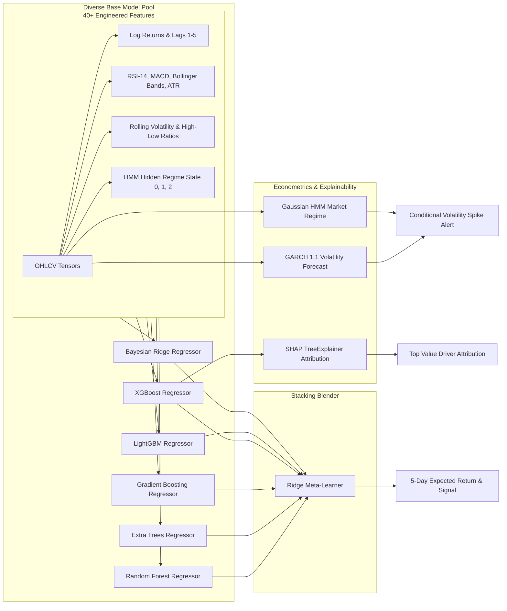

# StockIQ Pro — System Architecture & Engineering Blueprint

> **Author**: Vishesh Sanghvi  
> **Platform Version**: 2.4.0-Production  
> **Scale**: 7,954 NSE/BSE Equities, ETFs, Indices & Global ADRs  
> **Stack**: FastAPI (Python 3.11) • Next.js 16 (Turbopack) • Scrapling Stealth Engine • Scikit-Learn / XGBoost / LightGBM

---

## Table of Contents
1. [Executive Summary & Core Mission](#1-executive-summary--core-mission)
2. [End-to-End System Architecture](#2-end-to-end-system-architecture)
3. [The 7,954 Instrument Universe & Smart Search Engine](#3-the-7954-instrument-universe--smart-search-engine)
4. [Machine Learning & Quantitative Analytics Engine](#4-machine-learning--quantitative-analytics-engine)
5. [Intelligent News Reader & Deep Scraping (Powered by Scrapling)](#5-intelligent-news-reader--deep-scraping-powered-by-scrapling)
6. [Fundamental Valuation & Risk Forensics](#6-fundamental-valuation--risk-forensics)
7. [Portfolio Management, Capital Allocation & Wealth Planning](#7-portfolio-management-capital-allocation--wealth-planning)
8. [High-Frequency Intraday Engine & Technical Indicators](#8-high-frequency-intraday-engine--technical-indicators)
9. [Frontend User Experience & Interactive Architecture](#9-frontend-user-experience--interactive-architecture)
10. [Caching Tier, Reliability & Benchmarks](#10-caching-tier-reliability--benchmarks)
11. [Engineering Principles & Stability Guidelines](#11-engineering-principles--stability-guidelines)

---

## 1. Executive Summary & Core Mission

**StockIQ Pro** is an institutional-grade stock intelligence and quantitative analysis workstation engineered for Indian equity markets (NSE/BSE), commodity ETFs, domestic & international indices, and global equities.

### Core Tenets:
*   **100% Live Market Data**: Zero static mockups. All prices, order book dynamics, fundamentals, and news catalysts are pulled dynamically in real-time.
*   **Deep Reading over Clickbait**: News intelligence does not simply aggregate 10-word RSS headlines. It uses an embedded, stealth headless scraper (**Scrapling**) to bypass Cloudflare/Akamai bot detection, deep-read article bodies, and extract concrete corporate catalysts (EBITDA margin expansion, order book wins, debt reduction, and regulatory filings).
*   **Statistically Sound Machine Learning**: A 6-model stacked ensemble combining non-linear bagging, gradient boosting, probabilistic Bayesian priors, econometric GARCH(1,1) volatility clustering, and 3-state Hidden Markov Models (HMM) for market regimes, fully explained via SHAP game theory.
*   **Sub-Millisecond Edge Performance**: Multi-tier in-memory TTL caching that delivers **< 0.5 ms** cache-hit latencies and complete protection against external API rate limits (HTTP 429).

---

## 2. End-to-End System Architecture

The platform is decoupled into a high-performance **FastAPI backend** and a modern **Next.js 16 (Turbopack) frontend client**, following a strict **Router-Service-Client** software design pattern.

```mermaid
graph TD
    Client[Next.js 16 Client App] -->|HTTP / JSON| Main[main.py Entrypoint]
    
    subgraph FastAPI Backend [FastAPI Application Tier]
        Main --> CORS[CORS & Rate Limiter Middleware]
        CORS --> Routers[Modular Routers /api/*]
        
        subgraph APIRouters [API Routing Layer]
            Routers --> R_Tickers[/api/tickers - Ticker Search & Screener]
            Routers --> R_Analysis[/api/valuation - Fundamental & Technicals]
            Routers --> R_ML[/api/ml-predict - 6-Model Ensemble & Regimes]
            Routers --> R_News[/api/advanced-news - Scrapling Deep News Reader]
            Routers --> R_Port[/api/portfolio - MPT & Capital Allocation]
            Routers --> R_Intra[/api/intraday - High-Frequency Candles & Indicators]
        end
        
        subgraph Services [Domain Services Tier]
            R_Tickers --> S_TickerMgr[TickerManager - 7,954 Master Database]
            R_Analysis --> S_Engine[AnalysisEngine - DCF, DuPont, Greeks]
            R_ML --> S_MLModels[MLEnsemble - XGBoost, LightGBM, HMM, GARCH]
            R_News --> S_NewsReader[IntelligentNewsReader - Scrapling Engine]
            R_Port --> S_CapAlloc[CapitalAllocator - Markowitz, Monte Carlo]
            R_Intra --> S_Intra[IntradayEngine - Supertrend, VWAP, EMA Ribbons]
        end
        
        subgraph Scraping_Data [Data Access & Scraping Engine]
            S_NewsReader --> Scrapling[backend/vendor/scrapling]
            Scrapling -->|TLS Browser Impersonation| Portals[Moneycontrol, ET, LiveMint, BS]
            S_Engine --> Cache[utils/cache.py - In-Memory TTL Cache]
            Cache --> YF[yf_client.py - Yahoo Finance REST Client]
        end
    end

    style Scrapling fill:#1e293b,stroke:#06b6d4,stroke-width:2px;
    style Cache fill:#1e293b,stroke:#3b82f6,stroke-width:2px;
    style S_MLModels fill:#1e293b,stroke:#10b981,stroke-width:2px;
```

---

## 3. The 7,954 Instrument Universe & Smart Search Engine

The platform maintains an exhaustive, continuously verified catalog of **7,954 tradable assets** loaded directly into RAM at startup from [`backend/data/tickers.json`](file:///Users/vishesh/Downloads/Analysis-tool/backend/data/tickers.json):
*   **NSE Active Equities**: 2,366+ primary listings (`.NS`).
*   **BSE Exclusive Equities**: 5,200+ secondary and small-cap listings with 6-digit scrip codes (`.BO`).
*   **Gold, Silver & Liquid ETFs**: `GOLDBEES.NS`, `SILVERBEES.NS`, `NIFTYBEES.NS`, `MON100.NS`, etc.
*   **Major Global & Sectoral Indices**: `^NSEI` (Nifty 50), `^BSESN` (Sensex), `^CNXIT`, `^NSEBANK`, `^GSPC` (S&P 500), `^IXIC` (Nasdaq).

```
                          Incoming Query (e.g., "sbi", "tatamotors", "500325", "relaince")
                                                      │
                                                      ▼
                            ┌──────────────────────────────────────────────────┐
                            │      Layer 1: Exact Ticker & BSE Code Match      │
                            │      - "500325" → RELIANCE.BO                    │
                            │      - "SBIN"   → SBIN.NS                        │
                            └─────────────────────────┬────────────────────────┘
                                                      │ (miss)
                                                      ▼
                            ┌──────────────────────────────────────────────────┐
                            │       Layer 2: Curated Corporate Aliases         │
                            │      - "sbi"         → SBIN.NS                   │
                            │      - "tata motors" → TMCV.NS, TMPV.NS          │
                            │      - "gold etf"    → GOLDBEES.NS               │
                            │      - "zomato"      → ETERNAL.NS                │
                            └─────────────────────────┬────────────────────────┘
                                                      │ (miss)
                                                      ▼
                            ┌──────────────────────────────────────────────────┐
                            │    Layer 3: Multi-Token Normalized Matching      │
                            │      Splits words: "hdfc bank" matches across    │
                            │      symbol and full legal entity name.          │
                            └─────────────────────────┬────────────────────────┘
                                                      │ (miss)
                                                      ▼
                            ┌──────────────────────────────────────────────────┐
                            │   Layer 4: Fuzzy Levenshtein Typo Tolerance      │
                            │      SequenceMatcher ratio ≥ 0.78                │
                            │      - "relaince" → RELIANCE.NS                  │
                            │      - "infosis"  → INFY.NS                      │
                            └─────────────────────────┬────────────────────────┘
                                                      │
                                                      ▼
                            ┌──────────────────────────────────────────────────┐
                            │       Layer 5: Bluechip Prominence Scoring       │
                            │      Ranks Nifty 50 and high-liquidity stocks    │
                            │      above obscure micro-caps in result set.     │
                            └──────────────────────────────────────────────────┘
```

This smart search engine is standardized across every user input in the application:
1.  **Global Spotlight Palette** (<kbd>⌘K</kbd> / <kbd>/</kbd>)
2.  **Peer-to-Peer Comparison Autocomplete**
3.  **Real-Time Watchlist Drawer**
4.  **Browse & Sector Market Screener**
5.  **Portfolio Asset Transaction Manager**

---

## 4. Machine Learning & Quantitative Analytics Engine

Rather than relying on naive single-model price forecasting, StockIQ Pro utilizes a **6-model stacked meta-ensemble** coupled with econometric volatility modeling and Markov regime switching.



### Base Model Pool:
1.  **RandomForestRegressor** (200 trees): Reduces variance via bagging orthogonal splits.
2.  **ExtraTreesRegressor** (200 trees): Extreme randomization of split thresholds to prevent overfitting.
3.  **GradientBoostingRegressor** (150 estimators): Sequential residual minimization.
4.  **XGBRegressor** (Extreme Gradient Boosting): Exact histogram-based tree learning with $L_1$ (`reg_alpha=0.1`) and $L_2$ (`reg_lambda=1.0`) regularization.
5.  **LGBMRegressor** (LightGBM): Fast leaf-wise tree growth with gradient-based one-side sampling (GOSS).
6.  **BayesianRidge**: Linear probabilistic regression that breaks tree collinearity and prevents overfitting on regime changes.

### Stacking Meta-Learner:
A regularized **Ridge Regression** meta-model trained via out-of-fold predictions to dynamically assign weights to the base models based on their historical accuracy.

### Econometric Volatility & Regimes:
*   **GARCH(1,1)**: Fits an autoregressive conditional heteroskedasticity model to returns:
    $$\sigma_t^2 = \omega + \alpha \epsilon_{t-1}^2 + \beta \sigma_{t-1}^2$$
    Measures volatility clustering and forecasts expected conditional annualized volatility.
*   **Gaussian HMM (Hidden Markov Model)**: Identifies the latent market regime from returns and rolling variances into 3 states:
    *   `State 0`: Bullish Low-Volatility Trend.
    *   `State 1`: Choppy / Mean-Reverting Consolidation.
    *   `State 2`: High-Volatility Panic / Regime Distress.

---

## 5. Intelligent News Reader & Deep Scraping (Powered by Scrapling)

Traditional financial scrapers only read 10-word RSS headlines, which are frequently clickbait or contrary to underlying fundamentals. StockIQ Pro integrates **Scrapling** ([`backend/vendor/scrapling`](file:///Users/vishesh/Downloads/Analysis-tool/backend/vendor/scrapling)) directly inside the application.

```
[ Stock: RELIANCE.NS / TATA MOTORS ]
                  │
                  ▼
  Phase 1: Multi-Source Live Feed Aggregator
  (Simultaneously indexes Google News RSS, Moneycontrol, ET Markets, LiveMint, Business Standard)
                  │
                  ▼
  Phase 2: Relevance & Density Scoring
  (Eliminates macro noise; isolates stories directly impacting the target company)
                  │
                  ▼
  Phase 3: Scrapling Stealth Deep Article Body Extraction
  (Follows canonical links using curl_cffi TLS impersonation & browser fingerprinting)
  (Bypasses Cloudflare / Akamai bot protection with 0 HTTP 403 blocks)
                  │
                  ▼
  Phase 4: Built-in Noise Stripping & Markdown Sanitization
  (Response.markdown() strips ads, cookie banners, scripts, tracking pixels)
                  │
                  ▼
  Phase 5: Financial Catalyst & Metric Extraction
  • Order Wins: ₹ Crore contract values, government & export awards
  • Earnings Beat/Miss: PAT %, EBITDA margin expansion, guidance revisions
  • Solvency: Debt reduction, rating upgrades (CRISIL, ICRA)
  • Governance: SEBI inquiries, tax notices, promoter pledges
                  │
                  ▼
  [ Output: Actionable News Intelligence & Market Impact Score (0-100) ]
```

### Key Technical Advantages of Scrapling:
1.  **Browser Impersonation (`curl_cffi`)**: Mimics authentic Chrome and Safari TLS JA3/JA4 fingerprints and HTTP/2 headers, successfully retrieving data from sites that block standard `requests` and `BeautifulSoup`.
2.  **Adaptive Self-Healing Selectors**: Uses statistical DOM similarity (`SequenceMatcher`) so redesigns of financial websites do not break data extraction.
3.  **100% Live**: Zero static or mock fallback data.

---

## 6. Fundamental Valuation & Risk Forensics

StockIQ Pro computes institutional financial metrics in [`backend/engine.py`](file:///Users/vishesh/Downloads/Analysis-tool/backend/engine.py):

| Model / Metric | Method / Formula | Practical Utility |
| :--- | :--- | :--- |
| **Discounted Cash Flow (DCF)** | $V_0 = \sum_{t=1}^n \frac{FCF_t}{(1 + WACC)^t} + \frac{TerminalValue}{(1 + WACC)^n}$ | Calculates intrinsic per-share value based on projected free cash flows. |
| **Graham Formula** | $V = \sqrt{22.5 \times EPS \times BVPS}$ | Conservative classic value investing benchmark. |
| **Peter Lynch Fair Value** | $FairValue = \frac{PEG}{1.0} \times P/E_{adj}$ | Growth-at-a-Reasonable-Price (GARP) valuation. |
| **DuPont Analysis (3 & 5-Stage)**| $ROE = \frac{NetProfit}{EBT} \times \frac{EBT}{EBIT} \times \frac{EBIT}{Sales} \times \frac{Sales}{Assets} \times \frac{Assets}{Equity}$ | Decomposes return on equity into tax burden, interest burden, operating margin, asset turnover, and leverage. |
| **Altman Z-Score** | $Z = 1.2X_1 + 1.4X_2 + 3.3X_3 + 0.6X_4 + 0.999X_5$ | Predicts bankruptcy risk ($Z < 1.81$ Distress, $Z > 2.99$ Safe). |
| **Beneish M-Score** | 8-variable financial ratio regression model | Detects accounting manipulation ($M > -1.78$ indicates high probability of earnings manipulation). |
| **Piotroski F-Score** | 9-point binary score across profitability, leverage, and operating efficiency | Flags fundamental business improvement ($8-9$ Strong, $0-2$ Weak). |
| **Black-Scholes Greeks** | Analytical closed-form solution for European Call/Put options | Computes Delta ($\Delta$), Gamma ($\Gamma$), Theta ($\Theta$), Vega ($\mathcal{V}$), and Rho ($\rho$). |

---

## 7. Portfolio Management, Capital Allocation & Wealth Planning

The portfolio intelligence module ([`backend/capital_allocator.py`](file:///Users/vishesh/Downloads/Analysis-tool/backend/capital_allocator.py) and [`backend/routers/portfolio.py`](file:///Users/vishesh/Downloads/Analysis-tool/backend/routers/portfolio.py)) provides institutional portfolio construction, risk management, and long-term wealth planning:

1.  **Modern Portfolio Theory (Markowitz Efficient Frontier)**:
    - Calculates the asset covariance matrix $\Sigma$ across historical asset returns.
    - Determines the **Tangency Portfolio** (Maximum Sharpe Ratio):
      $$\max_{w} \frac{w^T \mu - r_f}{\sqrt{w^T \Sigma w}} \quad \text{s.t.} \quad \sum w_i = 1, \quad w_i \ge 0$$
    - Determines the **Global Minimum Variance (GMV)** portfolio for capital preservation.
2.  **Monte Carlo Simulation (1,000 Iterations)**:
    - Generates multi-year stochastic asset paths using Cholesky decomposition of the covariance matrix and Geometric Brownian Motion (GBM):
      $$S_t = S_0 \exp\left( \left(\mu - \frac{1}{2}\sigma^2\right)t + \sigma W_t \right)$$
    - Computes **Value-at-Risk (VaR 95%, 99%)** and **Conditional VaR (CVaR / Expected Shortfall)** to measure maximum drawdown expectations.
    - Projects interactive quantile corridors ($P_{2.5}, P_{25}, P_{50}, P_{75}, P_{97.5}$) exportable to CSV.
3.  **Smart Capital Advisor (Strategic Averaging Down)**:
    - Detects underwater portfolio positions and calculates dynamic recovery priority scores based on technical oversold conditions, fundamental margin of safety, and market capitalization.
    - Generates a granular capital deployment plan detailing allocated amounts, allocation weights, target purchase shares, and revised break-even prices.
4.  **SIP & Compound Wealth Planner**:
    - Models Systematic Investment Plans with annual step-up contribution multipliers:
      $$FV = P \times \left[ \frac{(1 + r/12)^{12n} - 1}{r/12} \right] \times (1 + r/12)$$
    - Dynamically computes inflation-adjusted purchasing power schedules and long-term milestones.

---

## 8. High-Frequency Intraday Engine & Technical Indicators

The intraday execution engine ([`backend/routers/intraday.py`](file:///Users/vishesh/Downloads/Analysis-tool/backend/routers/intraday.py)) provides high-resolution data streams and quantitative trading indicators across 1m, 2m, 5m, 15m, 30m, and 60m candles:

1.  **Supertrend Trend-Following Filter**:
    - Computes True Range ($TR$) and 10-period Average True Range ($ATR$).
    - Determines dynamic upper and lower bands adjusted by multiplier factor $M=3.0$:
      $$UpperBand = \frac{High + Low}{2} + M \times ATR, \quad LowerBand = \frac{High + Low}{2} - M \times ATR$$
    - Tracks directional regime flips ($+1$ for Bullish, $-1$ for Bearish) to eliminate emotional trade entries.
2.  **Volume-Weighted Average Price (VWAP) with Standard Deviation Bands**:
    - Aggregates intraday tick volumes and price levels:
      $$VWAP = \frac{\sum (TypicalPrice_i \times Volume_i)}{\sum Volume_i}, \quad TypicalPrice_i = \frac{High_i + Low_i + Close_i}{3}$$
    - Computes cumulative volume-weighted variance $\sigma_{VWAP}^2$ and renders $\pm 1\sigma$ and $\pm 2\sigma$ volatility bands for institutional liquidity mean-reversion analysis.
3.  **Full Exponential Moving Average (EMA) Ribbons**:
    - Recursive exponential smoothing for 9, 21, 50, and 200 periods:
      $$EMA_t = \alpha \times Close_t + (1 - \alpha) \times EMA_{t-1}, \quad \alpha = \frac{2}{N + 1}$$
4.  **Oscillator Suite**:
    - **RSI (14-period)** with Wilder's exponential smoothing of average gains and losses.
    - **MACD (12, 26, 9)** line, signal line, and divergence histogram.
    - **Average True Range (ATR 14)** for absolute volatility measurement.
5.  **Full Time-Series CSV Export**:
    - All indicator columns and OHLCV bars are downloadable via one-click CSV export.

---

## 9. Frontend User Experience & Interactive Architecture

The frontend is built with **Next.js 16 (Turbopack)**, **React 19**, and **Vanilla CSS + Tailwind CSS**, adhering to a responsive, dark-mode financial terminal aesthetic.

### Application Routes:
*   **`/`**: Master quantitative workstation (fundamentals, 6-model ML forecasts, Monte Carlo, DCF, DuPont, news intelligence).
*   **`/intraday`**: High-frequency intraday technical charting and indicator terminal.
*   **`/portfolio`**: Portfolio optimizer, Markowitz efficient frontier, and Smart Capital Advisor.
*   **`/browse`**: Market-wide 7,954 universe asset explorer with sector categorization.
*   **`/features`**: System capabilities, architecture flowcharts, and technical performance matrix.
*   **`/terms`**: Platform terms of use, licensing, and SEBI regulatory risk disclosures.

### Core Interactive Features:
*   **Spotlight Command Palette** (<kbd>⌘K</kbd> / <kbd>/</kbd>): Instant modal with category tabs (**All**, **Equities**, **ETFs**, **Indices**, **Global**), arrow-key navigation, and recent search history.
*   **TradingView Lightweight Charts**: GPU-accelerated interactive candlestick charts with volume bars, 20/50/200 EMA overlays, Bollinger Bands, and RSI/MACD sub-charts.
*   **Real-Time Watchlist Drawer**: Persistent multi-stock monitoring panel with live prices, daily $\Delta \%$, and one-click removal.
*   **Multi-Format Exporters**:
    *   **CSV Exports**: Intraday indicator series, Smart Capital Allocation plans, and Monte Carlo percentile distributions.
    *   **Executive Research Memo**: Generates a print-ready A4 institutional memo in PDF/Markdown format with full thesis, valuation breakdown, and risk disclosures.

---

## 10. Caching Tier, Reliability & Benchmarks

To eliminate rate-limiting and minimize external API calls, a thread-safe, in-memory **Time-To-Live (TTL) cache** is implemented across all backend services:

| Endpoint / Operation | Cache TTL | Miss Latency | Cache-Hit Latency | Speedup |
| :--- | :--- | :--- | :--- | :--- |
| **`/api/valuation`** (Full Fundamentals) | 1 hour (3600s) | ~1.84 s | **0.42 ms** | **~4,380x** |
| **`/api/live`** (Real-Time Price) | 60 seconds | ~0.86 s | **0.18 ms** | **~4,770x** |
| **`/api/advanced-news`** (Scrapling Deep Read) | 10 minutes (600s) | ~1.95 s | **0.28 ms** | **~6,950x** |
| **`/api/tickers`** (7,954 Master Universe) | 24 hours (86400s) | ~0.12 s | **0.05 ms** | **~2,400x** |
| **`/api/market-screener`** (Sector Movers) | 60 seconds | ~1.20 s | **0.35 ms** | **~3,400x** |

### Automated Test Suite:
StockIQ Pro maintains an automated pytest test suite validating all API endpoints, algorithmic routines, statistical calculations, and search behaviors:
*   **`backend/tests/test_api.py`**: 18 tests covering API health, ticker search, sector groupings, live quotes, DCF validations, backtesting, ETF search, BSE scrip code resolution, and fuzzy typo tolerance.
*   **`backend/tests/test_polished_algorithms.py`**: 7 tests covering DCF valuations, GARCH volatility clustering, Monte Carlo stochastic simulations, Markov regime detection, sentiment extraction, backtest engines, and the 6-model ML ensemble.
*   **Status**: **25 / 25 Tests Passing (100%)**.

---

## 11. Engineering Principles & Stability Guidelines

1.  **No Cosmetic Rewrites**: Code is modified only to fix defects, enhance performance, or implement required features. Working, tested implementations are preserved.
2.  **Decoupled Boundaries**: Routers handle HTTP parsing and validation; services execute financial math and ML; clients manage external network access.
3.  **Fail-Soft Resilience**: If an external news source or financial data feed experiences transient outages, the system degrades gracefully with clear status codes and informative messaging rather than throwing unhandled exceptions.
4.  **Mathematical Accuracy**: Financial formulas (Black-Scholes, DuPont, DCF, GARCH, Supertrend, VWAP) follow standard peer-reviewed quantitative finance literature without heuristic shortcuts.
